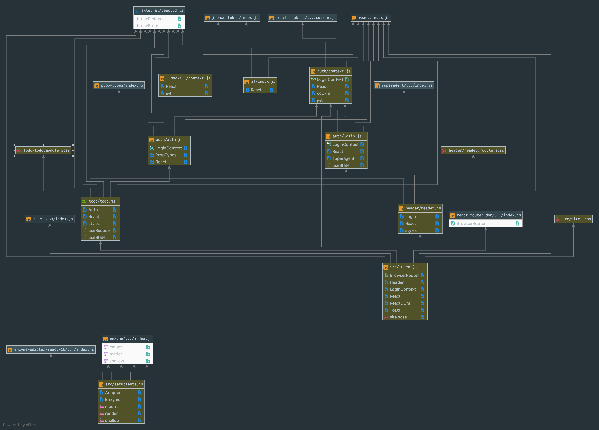

# LAB - 29

 ## react-testing

 ### Author: Evan Brecht-Curry

 ### Links and Resources
* [submission PR](https://github.com/evan-401-advanced-javascript/lab-27-react-testing/pull/1)
* [travis](https://www.travis-ci.com/evan-401-advanced-javascript/lab-27-react-testing)
* [netlify](https://boring-brown-b22f57.netlify.com/) 
* [docs]( http://localhost:6060/)

 ##### Exported Values and Methods

### Setup
* `npx styleguidist server`

#### `.env` requirements

 #### UML
